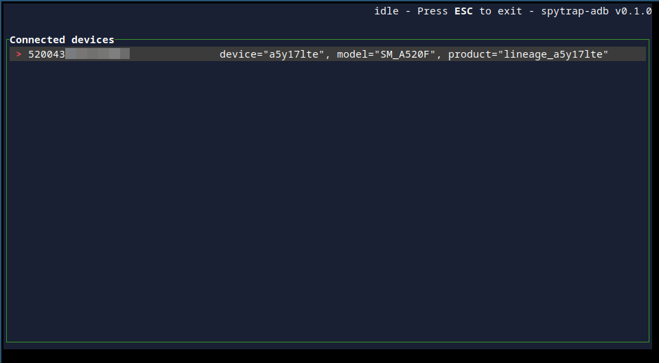
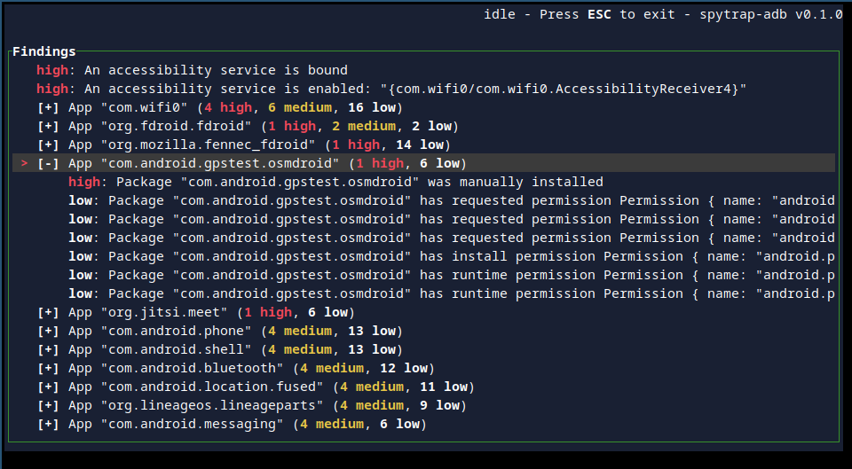

# spytrap-adb

Test a phone for stalkerware using adb and usb debugging to scan for suspicious
apps and configuration.

Based on [stalkerware-indicators] data provided by [Echap].

[stalkerware-indicators]: https://github.com/AssoEchap/stalkerware-indicators
[Echap]: https://github.com/AssoEchap

[](.github/screenshot-device-list.png)

[](.github/screenshot-findings-list.png)

## Usage

There's an interactive UI when running the command with no arguments:

```sh
spytrap-adb
```

Enable usb debugging on the phone and connect it to the computer over usb.

You can also invoke some commands directly for non-interactive use:

```sh
# list available devices
spytrap-adb list
# download indicators of compromise from https://github.com/AssoEchap/stalkerware-indicators
spytrap-adb download-ioc
# scan the first connected device
spytrap-adb scan
```

## Installation

<a href="https://repology.org/project/spytrap-adb/versions"></a>

**Arch Linux**

    pacman -S spytrap-adb

**Debian (sid)**

    apt-get install spytrap-adb

**Debian >= bookworm, Ubuntu >= 20.04**

    sudo apt install ca-certificates curl gnupg
    curl -sSf https://apt.vulns.xyz/kpcyrd.pgp | gpg --dearmor |  sudo tee /etc/apt/trusted.gpg.d/apt-vulns-xyz.gpg > /dev/null
    echo deb https://apt.vulns.xyz stable main | sudo tee /etc/apt/sources.list.d/apt-vulns-xyz.list
    apt update
    apt install spytrap-adb

**Pre-compiled binary (x86_64)**

    wget https://github.com/spytrap-org/spytrap-adb/releases/latest/download/spytrap-adb
    chmod +x
    ./spytrap-adb

This binary can be independently reproduced from source code, reproducible builds instructions can be found on the relevant [releases](https://github.com/spytrap-org/spytrap-adb/releases) page.

## Building from source

```sh
# install rustup
curl --proto '=https' --tlsv1.2 -sSf https://sh.rustup.rs | sh
# clone the repository
git clone https://github.com/spytrap-org/spytrap-adb
# enter the directory
cd spytrap-adb/
# compile the project
cargo build --release --locked
# this is the release binary
./target/release/spytrap-adb
```

## Example output

```
% target/release/spytrap-adb scan
[2021-12-19T21:26:41Z INFO  spytrap_adb] Loaded 130 rules from "/home/user/.local/share/spytrap-adb/ioc.yaml"
[2021-12-19T21:26:41Z INFO  spytrap_adb] Device is not rooted
[2021-12-19T21:26:41Z INFO  spytrap_adb] Fetching remote clock
[2021-12-19T21:26:41Z INFO  spytrap_adb] Local time is 2021-12-19 21:26:41.847457823 UTC, remote time is 2021-12-19 21:26:42.318497288 UTC, drift=PT0.471039465S
[2021-12-19T21:26:41Z INFO  spytrap_adb] Comparing list of installed apps with known stalkerware ids
[2021-12-19T21:26:41Z INFO  spytrap_adb] Scanning installed apps (0/192)
[2021-12-19T21:26:41Z WARN  spytrap_adb] Suspicious Medium: Package "org.jitsi.meet" was manually installed
[2021-12-19T21:26:42Z WARN  spytrap_adb] Suspicious Medium: Package "com.android.gpstest.osmdroid" was manually installed
[2021-12-19T21:26:46Z WARN  spytrap_adb] Suspicious Medium: Package "org.fdroid.fdroid" was manually installed
[2021-12-19T21:26:46Z INFO  spytrap_adb] Scanning installed apps (100/192)
[2021-12-19T21:26:48Z WARN  spytrap_adb] Suspicious Medium: Package "com.wifi0" was manually installed
[2021-12-19T21:26:50Z INFO  spytrap_adb] Enumerating service list
[2021-12-19T21:26:50Z INFO  spytrap_adb] Reading accessibility settings
[2021-12-19T21:26:50Z INFO  spytrap_adb::accessibility] Reading accessibility settings
[2021-12-19T21:26:50Z WARN  spytrap_adb::accessibility] Found bound accessibility services: "Service[label=WiFi, feedbackType[FEEDBACK_SPOKEN, FEEDBACK_HAPTIC, FEEDBACK_AUDIBLE, FEEDBACK_VISUAL, FEEDBACK_GENERIC, FEEDBACK_BRAILLE], capabilities=1, eventTypes=TYPES_ALL_MASK, notificationTimeout=1000, requestA11yBtn=false]"
[2021-12-19T21:26:50Z WARN  spytrap_adb::accessibility] Found enabled accessibility services: "{com.wifi0/com.wifi0.AccessibilityReceiver4}"
[2021-12-19T21:26:50Z WARN  spytrap_adb] Suspicious High: An accessibility service is bound
[2021-12-19T21:26:50Z WARN  spytrap_adb] Suspicious High: An accessibility service is enabled: "{com.wifi0/com.wifi0.AccessibilityReceiver4}"
[2021-12-19T21:26:50Z INFO  spytrap_adb] Scan finished
```

## FAQ

### `Error: Failed to list devices: Connection refused (os error 111)`

The adb server is not running correctly

### Installing adb on MacOS

    brew install spytrap-adb

### Installing adb on Arch Linux

    pacman -S android-tools

### Installing adb on Debian/Ubuntu

    apt install adb

## Similar work

- [MVT (Mobile Verification Toolkit)](https://github.com/mvt-project/mvt)

## License

`GPL-3.0-or-later`
